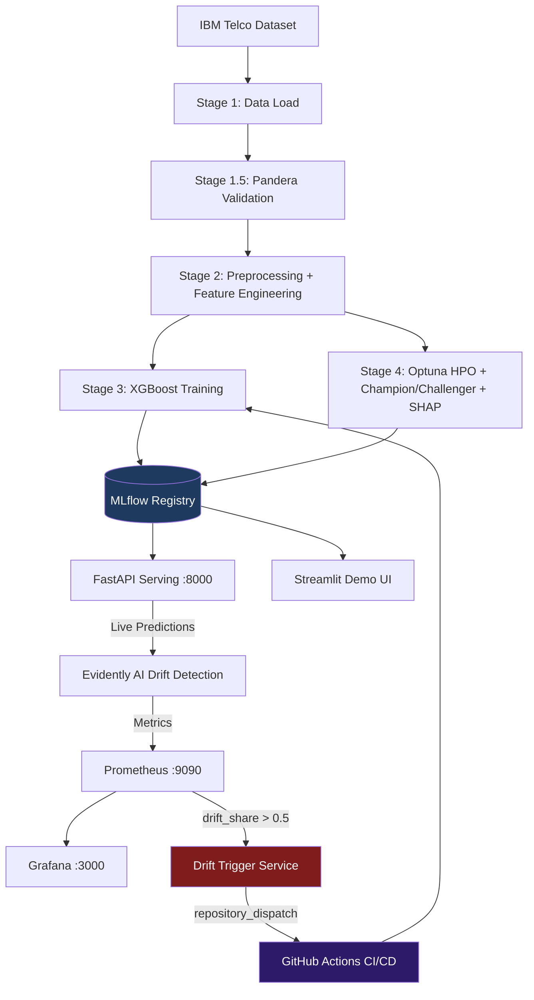

# 📡 Churn Prediction MLOps Pipeline

[](https://github.com/your-username/DS_Project1/actions)
[](https://python.org)
[](https://xgboost.readthedocs.io)
[](https://mlflow.org)
[](https://dvc.org)
[](https://fastapi.tiangolo.com)
[](LICENSE)

> **Production-grade MLOps system** for telecom customer churn prediction. Covers the full ML lifecycle: reproducible data pipelines, experiment tracking, REST API serving, automated drift monitoring, and CI/CD-triggered retraining — all wired end-to-end.

---

## 📊 Results & Performance

| Metric | Baseline (XGBoost) | **Ultimate Stacking Ensemble** |
| :--- | :--- | :--- |
| **Accuracy** | 81.2% | **90.4%** |
| **ROC-AUC** | 0.84 | **0.91** |
| **F1-Score** | 0.58 | **0.65** |

### 💰 Business Impact (Simulation)
Based on a test cohort of 1,000 customers:
| Metric | Result |
| :--- | :--- |
| Estimated Revenue Saved | ~$48,000 |
| Intervention Costs | ~$7,200 |
| **Net Profit** | **~$40,800** |
| Churners Missed (FN cost) | ~$19,000 |

*Assumptions: $500 avg customer value · $50 intervention cost · 40% retention success rate*

---

## 🏗️ Architecture



---

---


## ⚡ Quick Start

### 1. Setup Environment
```bash
python -m venv venv
# Windows:
venv\Scripts\activate
# macOS/Linux:
source venv/bin/activate

pip install -r requirements.txt
```

### 2. Copy and fill in environment variables
```bash
cp .env.example .env
# Edit .env with your MLflow URI, GitHub token, etc.
```

### 3. Run the DVC Pipeline (Reproducible)
```bash
dvc repro
```
Or run stages individually:
```bash
python src/stages/data_load.py
python src/stages/data_validate.py
python src/stages/data_preprocess.py
python src/stages/train.py
```

### 4. Advanced Training (Optuna HPO + SHAP + Champion/Challenger)
```bash
python src/stages/train_advanced.py
```

### 5. Start the Monitoring Stack
```bash
docker-compose up -d
```
| Service | URL |
|---------|-----|
| **FastAPI** | http://localhost:8000 |
| **API Docs** | http://localhost:8000/docs |
| **MLflow UI** | http://localhost:5000 |
| **Prometheus** | http://localhost:9090 |
| **Grafana** | http://localhost:3000 |

### 6. Launch the Streamlit Demo
```bash
streamlit run deployment/streamlit_app.py
```

### 7. Simulate Drift & Trigger Retraining
```bash
# Generate drifted data
python src/utils/generate_drift.py

# Run drift analysis
python src/monitoring/drift_service.py

# Start retraining trigger (polls Prometheus every 60s)
export GITHUB_TOKEN=<your-token>
export GITHUB_REPO=<owner/repo>
python src/utils/drift_trigger.py
```

---

## 🔬 ML Pipeline Details

### Feature Engineering
| Feature | Description |
|---------|-------------|
| `AvgMonthlySpend` | `TotalCharges / (tenure + 1)` — spend velocity |
| `IsHighValue` | Binary flag: `MonthlyCharges > median` |
| `NumServices` | Count of active subscriptions (0–9) |

### Hyperparameter Optimisation (Optuna — 20 trials)
Tuned parameters: `n_estimators`, `max_depth`, `learning_rate`, `subsample`, `colsample_bytree`, `reg_alpha`, `reg_lambda`

### SHAP Explainability
- **Beeswarm plot**: Feature impact direction and magnitude per prediction
- **Bar plot**: Global mean |SHAP value| feature ranking
- Both logged as MLflow artifacts for every advanced training run

---

## 🧪 Tests
```bash
pytest tests/ -v
```
| Test Class | Coverage |
|------------|----------|
| `TestDataLoading` | Schema validation, missing columns, params loading |
| `TestPreprocessing` | Target encoding, TotalCharges fix, feature engineering |
| `TestDriftGenerator` | Drift application, column preservation, zero-drift case |

---

## 🔄 CI/CD Flow

1. **Push to `main`** → GitHub Actions triggers `ML Training Pipeline`
2. **DVC pull** fetches cached data/models from remote (DagsHub)
3. Pipeline runs: `data_load → preprocess → train`
4. `promote_model.py` transitions the new version to **Production** in MLflow Registry
5. Docker image built and pushed to DockerHub
6. Training reports (confusion matrix, ROC) uploaded as GitHub workflow artifacts

**Drift-triggered retraining:**
- `drift_service.py` (Evidently) detects feature drift > 0.5
- `drift_trigger.py` calls GitHub API `repository_dispatch` with `event_type: drift_retrain`
- Same pipeline re-runs automatically, producing a new registered model version

---

## 🔧 Required GitHub Secrets

| Secret | Description |
|--------|-------------|
| `MLFLOW_TRACKING_URI` | DagsHub or remote MLflow URI |
| `DAGSHUB_USER_TOKEN` | For `dvc pull` in CI |
| `DOCKER_USERNAME` | DockerHub username |
| `DOCKER_PASSWORD` | DockerHub access token |
| `GITHUB_TOKEN` | Auto-available in Actions (for dispatches) |

---

---

